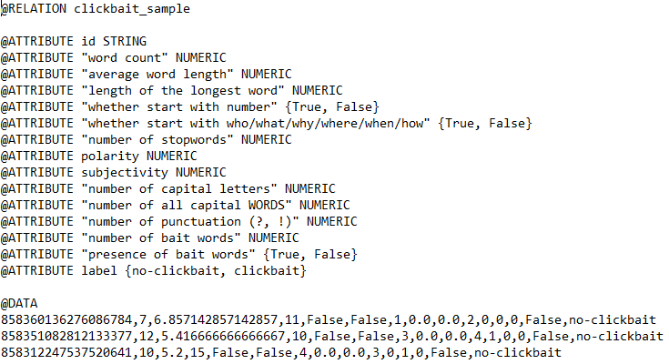

**Note:** This repository is part of a programming task of Sungkyunkwan University's ["Using Data Science to Detect Frauds and Fakes"](https://summer.skku.edu/_res/summer/etc/Data&Phy_A1.pdf "Class Syllabus") class. Students were advised to do some feature engineering first and then evaluate the dataset with [Weka](https://www.cs.waikato.ac.nz/ml/index.html "Weka Homepage"). Weka is a collection of machine learning algorithms for data mining tasks. It contains tools for data preparation, classification, regression, clustering, association rules mining, and visualization (from Weka's [homepage](https://www.cs.waikato.ac.nz/ml/weka/index.html "Weka Homepage")).

# About
We want to build a classfication model that is able to [detect clickbait posts in social media](https://www.clickbait-challenge.org "Clickbait Challenge"). 

This repository is divided into two parts. First, we need to download the dataset and need to create some features for our classfication model. After that, I will post a detailed guide how to train and test a classification model in Weka below.

# Clickbait Challenge Dataset
The Clickbait Challenge dataset provides a JSON file with 19538 examples (Twitter posts linking a news article). This is an example Twitter post from the dataset: [Ban lifted on Madrid doping laboratory](https://twitter.com/bbcworld/status/858224473597779969?lang=en "Twitter Post") and in the JSON file it looks like this:

```
from instances.jsonl

{
 "id": "858224473597779969",
 "postTimestamp": "Sat Apr 29 07:40:34 +0000 2017",
 "postText": ["Ban lifted on Madrid doping laboratorys"],                     #Twitter post
 "postMedia": [""],                                                           #if the Twitter post has an image attached 
 "targetTitle": "World Anti-Doping Agency lifts ban on Madrid laboratory",    #actual article headline/article
 "targetDescription": "Madrid's Anti-Doping Laboratory has its...",           #description below a headline
 "targetKeywords": "",
 "targetParagraphs": [                                                        #article text. One sentence is one list element
 "Share this with", 
 "Madrid's Anti-Doping Laboratory has had its suspension lifted...", 
 "The laboratory was sanctioned in June 2016 after Wada said the Spanish...",
 ...],
 "targetCaptions": ["Samples in an anti-doping laboratory..."]                #photo captions in the article 
} 

```

To make it simple, we will only use the "postText" key from the dataset for now. This key contains the written text of a Twitter post.

# Dataset and Feature Engineering
Download the dataset on the [Clickbait Challange homepage](https://www.clickbait-challenge.org "Clickbait Challenge") (latest release date: June 30, 2017). The .zip file contains `instances.jsonl` and `truth.jsonl` that we need later.

Weka requires an .arff file in order to run Machine Learning models. A .arff file looks like this:



We need to write in the .arff file what kind of attributes we want to use (@ATTRIBUTE) and in @DATA one line represents one training/test example with our feature attributes. If you want to add or remove any features, just edit the methods in `extract_features.py` and then edit `preprocessing.py` as well (specifically start to edit at line 34, 49 and 81). 

I'm using the following features (that may or may not be useful, feature selection can be done later):
* `id` ID of an example
* `word count` How many words are in one Twitter post
* `average word length`
* `length of the longest word`
* `whether start with number` (e.g. 10 Destinations You Need to Visit, 5 Things You Need to Know)
* `number of stopwords` (clickpost tend to have longer, complete sentences, so maybe they have more stopwords)
* `polarity` (How polar is a post? Taken from Textblob library)
* `subjectivity` (How subjective is a post? Taken from Textblob library)
* `number of capital letters`
* `number of all capital WORDS`
* `number of puctuation (?, !)`
* `number of bait words` (I created a list that contains usual clickbait words like "best", "need", "should", "most" etc.)
* `presence of bait words`
* `label` ("no-clickbait or clickbait)


Again, these features may or may not be useful for this task. You need to test it or feature engineer more features. I took some inspiration from [Chakraborty et al. (2016)](https://www.researchgate.net/publication/310809794_Stop_Clickbait_Detecting_and_preventing_clickbaits_in_online_news_media "Paper").

# Requirements
* Download the latest [Weka](https://www.cs.waikato.ac.nz/ml/weka/downloading.html "Weka") version.
* to create an .arff file, you need to download the [arff library](https://pypi.python.org/pypi/liac-arff) in your environment: `pip install liac-arff`

# Usage

## Preprocessing

After downloading the dataset (with `instances.jsonl` and `truth.jsonl`) run the `preprocessing.py` file to create an `.arff` file for Weka. Run this command:

```
python preprocessing.py --path_training <instances.jsonl location>
                        --path_truth <truth.jsonl location>
                        --output_path_training <location where you want to save the training .arff file>
                        --output_path_test <location where you want to save the test .arff file>
                        --size_test_set <how much of the dataset should be set aside for the test set (default 0.3)>

parser.add_argument("--path_training", type=str, help="path to clickbait training jsonl file")
parser.add_argument("--path_truth", type=str, help="path to clickbait truth jsonl file")
parser.add_argument("--output_path_training", type=str, help="output path of arff training file")
parser.add_argument("--output_path_test", type=str, help="output path of arff test file")
parser.add_argument("--size_test_set", type=float, default=0.3, help="size of the test set in regard to the whole dataset (e.g. 0.2, 0.3, 0.4 of whole dataset")
```
